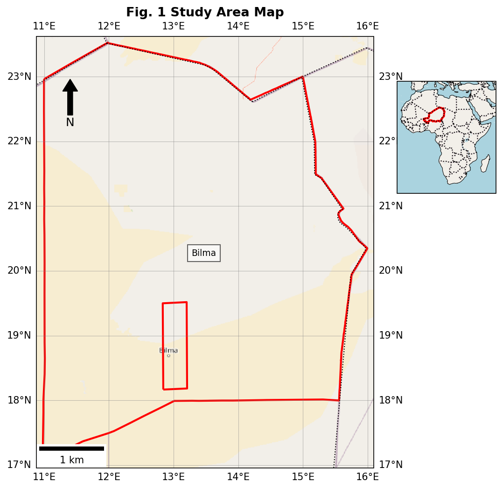
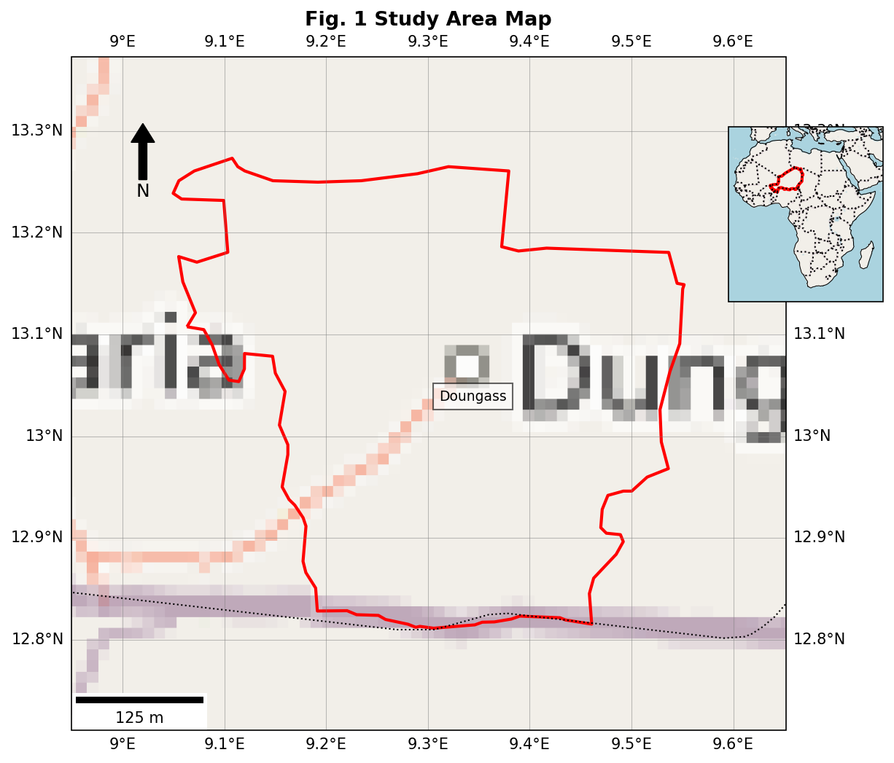

# 🗺️ Study Area Map Generator

**Study Area Map Generator** is a web-based Python Shiny application developed to help researchers, students, and educators generate **publication-ready maps** of countries or specific places. The tool is especially useful for scientific papers, these, reports, and presentations where spatial context needs to be clearly communicated.

---

## 🧭 Features

- Select a country from a global list using a GeoJSON file
- Alternatively, search for any city or location using OpenStreetMap (OSM)
- Automatically zooms and centers on the selected area
- Customize the map title
- Choose inset map position (upper right or bottom right)
- Switch between **OpenStreetMap** and **Google Hybrid** basemaps
- Adjust zoom level for better spatial focus
- High-resolution map outputs include:
  - Country or region boundaries
  - North arrow
  - Coordinate grid
  - Scale bar
  - Inset map for geographic context

---

## 🚀 Live Demo

Try the app here:
👉 [https://01980bc6-c388-8af3-fdea-91742703c223.share.connect.posit.cloud](https://01980bc6-c388-8af3-fdea-91742703c223.share.connect.posit.cloud)


---

## 📷 Screenshots

### Municipality Search Example


### Departement Search Example


---

## 🔧 Installation

You can run the app locally using **Python ≥ 3.11**.

### 1. Clone the Repository

```bash
https://github.com/halieute/country_map_generator_nig.git
cd country_map_generator_nig
```

### 2. Create a Virtual Environment

```bash
conda create -n country_map_app python=3.12
conda activate country_map_app
```

### 3. Install Requirements

```bash
pip install -r requirements.txt
```

### 4. Run the App Locally

```bash
python -m shiny run --reload app.py
```

Then open your browser at:
[http://127.0.0.1:8000](http://127.0.0.1:8000)

---

## 📁 File Structure

```
country-map-generator/
├── app.py             # Main Shiny app
├── gadm41_NER_0.json  # GeoJSON with country boundaries
├── gadm41_NER_1.json  # GeoJSON with first-level administrative boundaries
├── gadm41_NER_2.json  # GeoJSON with second-level administrative boundaries
├── gadm41_NER_3.json  # GeoJSON with third-level administrative boundaries
├──  requirements.txt # Python dependencies
├── LICENCE           # Project license
├── docs/             # Documentation files
│   ├── example_bilam.png # Example map with inset
│   └── example_doungas.png # Example map with inset
├── README.md        # Project overview and instructions
```

---

## 📦 Dependencies

- [Shiny for Python](https://shiny.posit.co/py/)
- GeoPandas
- Cartopy
- Matplotlib
- geopy
- matplotlib-scalebar

---

## 🧠 Use Cases

- Create clear and consistent maps for study areas
- Avoid the need for complex desktop GIS software
- Ideal for:
  - Remote sensing projects
  - Environmental and climate research
  - Academic these and fieldwork documentation
  - Scientific publications and presentations

---

## 👨‍💻 Author

- **Souleymane Maman Nouri Souely** -Atlatic Technical University Cabo Verde

📧 ssouley@uta.cv
🔗 [LinkedIn Profile](www.linkedin.com/in/souleymanemamannourisouley)

---

## 📄 License

This project is licensed under the MIT License. See the [LICENSE](LICENSE) file for details.

---

⭐️ *If you find this project useful, please consider giving it a star on GitHub.*
